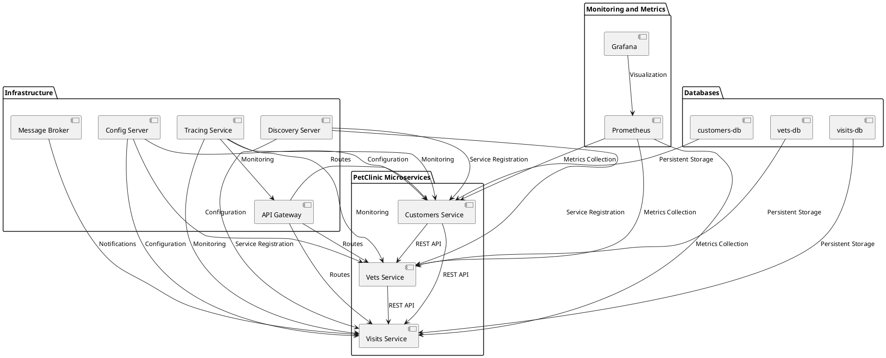

# Exercício E7: Microsserviços

 

## Opção Escolhida: Letra "c"

Neste exercício, foi solicitada a escolha entre três opções para a execução da atividade relacionada a microsserviços:

- **a)** Executar o roteiro da aula anterior
- **b)** Executar um exemplo da Spring sobre microsserviços (dica: usar a spring-petclinic-microservices)
- **c)** Elaborar um diagrama da UML: componentes ou implantação (destacar serviços da aplicação e dependencias)

A opção escolhida foi a *letra "c", onde foi elaborado um **diagrama UML** de componentes para o spring-petclinic-microservices.

### 1. Contexto

A aplicação escolhida para a elaboração do diagrama foi a **spring-petclinic-microservices**, que é o exemplo prático e bem estabelecido no uso de arquitetura de microsserviços utilizando **Spring Cloud* que foi passado em aula. A aplicação simula uma clínica veterinária, onde os serviços são divididos em diversos microsserviços independentes, como o serviço de gerenciamento de donos de pets, visitas, veterinários, entre outros.

### 2. Descrição do Diagrama

O diagrama criado aborda .... Nele, são evidenciadas as principais funcionalidades da aplicação Spring PetClinic Microsserviços e as dependências entre elas.

#### 2.1 Componentes

-

#### 2.2 Dependências

- 

### 3. Diagrama UML

*Colocar imagem*

### 4. Script para a criação do diagrama UML

### 5. Conclusão

A arquitetura de microsserviços, conforme ilustrada no diagrama, permite que a aplicação *Spring PetClinic* seja modular, escalável e resiliente. Cada componente desempenha um papel crucial na integração e comunicação entre os serviços, utilizando ferramentas robustas do *Spring Cloud* como *Eureka, **Feign, **Hystrix* e *Ribbon*.

Com a divisão dos serviços, a aplicação se beneficia de maior flexibilidade, uma vez que cada parte pode ser desenvolvida, mantida e escalada de forma independente, seguindo os princípios da arquitetura de microsserviços.

---

*Referências:*

- Spring PetClinic Microsservices [GitHub](https://github.com/spring-petclinic/spring-petclinic-microservices)
- Documentação do [Spring Cloud](https://spring.io/projects/spring-cloud)
