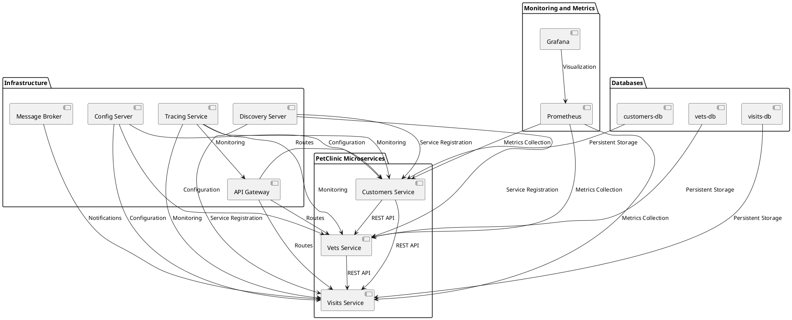

# Exercício E7: Microsserviços

 

## Opção Escolhida: Letra "c"

Neste exercício, foi solicitada a escolha entre três opções para a execução da atividade relacionada a microsserviços:

- **a)** Executar o roteiro da aula anterior
- **b)** Executar um exemplo da Spring sobre microsserviços (dica: usar a spring-petclinic-microservices)
- **c)** Elaborar um diagrama da UML: componentes ou implantação (destacar serviços da aplicação e dependencias)

A opção escolhida foi a *letra "c", onde foi elaborado um **diagrama UML** de componentes para o spring-petclinic-microservices.

### 1. Contexto

A aplicação escolhida para a elaboração do diagrama foi a **spring-petclinic-microservices**, que é o exemplo prático e bem estabelecido no uso de arquitetura de microsserviços utilizando **Spring Cloud** que foi passado em aula. A aplicação simula uma clínica veterinária, onde os serviços são divididos em diversos microsserviços independentes, como o serviço de gerenciamento de donos de pets, visitas, veterinários, entre outros.

### 2. Descrição do Diagrama
O diagrama elaborado é um **diagrama de componentes** da aplicação **spring-petclinic-microservices**. Ele ilustra como os diferentes serviços da aplicação interagem entre si e com os componentes de infraestrutura, como o servidor de descoberta (Eureka), o servidor de configuração (Spring Cloud Config) e o API Gateway.

Os principais componentes representados são:
- **Customers Service**: Gerencia as informações sobre os proprietários dos pets.
- **Vets Service**: Responsável por gerenciar as informações sobre os veterinários.
- **Visits Service**: Controla o registro das visitas dos pets ao veterinário.
- **API Gateway**: Atua como ponto de entrada para as requisições dos clientes e as distribui para os serviços adequados.
- **Discovery Server**: Serviço de registro e descoberta de outros microsserviços.
- **Config Server**: Centraliza as configurações para todos os serviços.
- **Message Broker**: Usado para notificações assíncronas entre os serviços.
- **Tracing Service**: Monitora e rastreia as requisições entre os microsserviços.
- **Databases**: Cada serviço tem sua própria base de dados para armazenamento persistente.
- **Prometheus e Grafana**: Utilizados para coleta e visualização de métricas.

### 3. Diagrama UML

 

- Link diagrama componentes PlantUML [Diagrama](https://www.planttext.com/api/plantuml/png/bPHDRi8m48NtdC9YpmLOL6sXGYnIHO2wGLqCPf9Q1BkonrIqwjthuj2OE9Wqg_pCz_AUP-nxGw39xgl1u1tu3afamnnfKWafECi4rygWFWYEPiY-1inTwuarfFQe3LlwJwziDBfZwnUauDMOBPwMA_QGpszGmeWKTwbw2_aESinbeS6GjfoinZ_xhepDWF03ZhLUXpKdgIoXkOP4MTFLiM5Vxu6fC5mTK1zF5QXJjkfRji1Ik6n0GicaIjlf_mKYyvqITPULB4JP8uSljE7_kzYs-xvOvFaIz6I6nlnEogDMkmJwh4WKWf_8SyjM6hYGPMimBpe_PfcIWfHsTIceStdweUtLwKb52GCkt41J8DY02RO-FtiTRJSf-xbxTgE1ajZI2Jirpn-SuGPjsxzAdGm7N1IWWmo3DFaOo2tBaBJWJQfSkm3qXjOaM-8fDqbLXRoPluYEkj8RZ1jp1PrfA412pOL2O-PKB5JYqq-wMuPxb5jtmly0)

### 4. Script para a criação do diagrama UML

### 5. Conclusão
O diagrama criado apresenta a arquitetura da aplicação spring-petclinic-microservices destacando os componentes e suas dependências. Ele facilita a compreensão das interações entre os microsserviços e os componentes de infraestrutura necessários para o funcionamento da aplicação. 

---

*Referências:*

- Spring PetClinic Microsservices [GitHub](https://github.com/spring-petclinic/spring-petclinic-microservices)
- Documentação do [Spring Cloud](https://spring.io/projects/spring-cloud)
